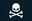

<h1>Hi, I'm Austin! <bhttps://github.com/AustinKruse/AustinKruse><a href="https://www.linkedin.com/in/austinbkruse/">Aspiring CyberSecurity Professional</a></h1>

## About
I've been in Tech Support for years & I'm aspiring to focus soley on Cybersecurity.  

I'm a 2nd Degree Black Belt in Taekwondo, former football Running back, former center forward Soccer player, while concurrently holding a near 4.0 GPA.
I enjoy playing video games, paintball, sports, and hacking!
I created this page to showcase my skillsets in further detail. 

## 👨‍💻 CyberSecurity Experience:

### Certifications:
 - **[CompTIA Security+ ce (2024)](https://www.credly.com/badges/8fa3a732-8264-479b-8810-8d32632fefbf/linked_in_profile)**
 - **[Cyber Defense Pathway (TryHackMe) - Certificate of Completion (2024)](https://tryhackme-certificates.s3-eu-west-1.amazonaws.com/THM-GVRNCHPWBM.png)**
 - **Linux Essentials (2022)**
 - **[CompTIA Pentest+ Pathway (TryHackMe) - Certificate of Completion (2022)](https://tryhackme-certificates.s3-eu-west-1.amazonaws.com/THM-QDMD6S7DZX.png)**
 - **[AWS Cloud Practitioner Essentials (Second Edition): Introduction to the AWS Cloud](https://github.com/AustinKruse/AustinKruse/blob/main/assets/AWS-Training-%26-Certification-Certificate-of-Completion.pdf)**

### College Classes:
#### **These classes align with the NSA Center of Academic Excellence in Cyber Operations (CAE-CO) requirements for Offensive and Defensive Cyber Operations.**
 - Cyber Operations
 - Active Cyber Defense (SIEM Labs)
 - Cyber Threat Intelligence
 - Malware Threats & Analysis (Static & Dynamic Analysis)
 - Violent Python
 - Cyber Warfare (Recon, Scanning & Exploitation, Post Exploitation, Password Attacks & Defenses, Web App Attacks, Social Engineering)
 - Cloud Computing
 - Wireless Networking & Security (3G, 4G, 5G)

### TryHackMe & Projects
  - [TryHackMe Profile - Top 2% Globally](https://tryhackme.com/p/TaqTix)

|                               🌟 **TryHackMe Experience** 🌟                               |                           📄 **TryHackMe Writeups** 📄                            |
| :---------------------------------------------------------------------------------------: | :------------------------------------------------------------------------------: | 
| [🌐 Currently in the TOP 2% Globally](https://tryhackme.com/p/TaqTix)     | [📝 Autopsy](https://github.com/AustinKruse/Obsidian-Vault/blob/main/Cyber%20Defense%20Labs/Autopsy.md)                                      |
| [📚 Cyber Defense Pathway Outline](https://tryhackme.com/path/outline/blueteam)           | [📝 Basic Malware Reverse Engineering](https://github.com/AustinKruse/Obsidian-Vault/blob/main/Cyber%20Defense%20Labs/Basic%20Malware%20Reverse%20Engineering.md) |
| [📋 Cyber Defense Pathway Certificate of Completion](https://tryhackme-certificates.s3-eu-west-1.amazonaws.com/THM-GVRNCHPWBM.png) | [📝 Disk Analysis & Autopsy](https://github.com/AustinKruse/Obsidian-Vault/blob/main/Cyber%20Defense%20Labs/Disk%20Analysis%20%26%20Autopsy.md) |
| [📊 Splunk](https://tryhackme.com/r/room/splunk2gcd5)                                     | [📝 Investigation Windows](https://github.com/AustinKruse/Obsidian-Vault/blob/main/Cyber%20Defense%20Labs/Investigating%20Windows.md)     |
| [🔍 WireShark](https://tryhackme.com/r/room/wireshark)                                    | [📝 Redline & IOC Editor](https://github.com/AustinKruse/Obsidian-Vault/blob/main/Cyber%20Defense%20Labs/Redline%20%26%20IOC%20Editor.md) |
| [🔐 Active Directory](https://tryhackme.com/r/room/attacktivedirectory)                   | [📝 Volatility - Memory Forensics](https://github.com/AustinKruse/Obsidian-Vault/blob/main/Cyber%20Defense%20Labs/Volatility%20-%20Memory%20Forensics%20THM%20Walkthrough%20(Windows).md) |
|                                                                                           | [📝 Windows Forensics 1](https://github.com/AustinKruse/Obsidian-Vault/blob/main/Cyber%20Defense%20Labs/Windows%20Forensics%201.md)       |
|                                                                                           | [📝 Windows Forensics 2](https://github.com/AustinKruse/Obsidian-Vault/blob/main/Cyber%20Defense%20Labs/Windows%20Forensics%202.md)       |

### [TryHackMe Cyber Defense Pathway Outline](https://tryhackme.com/path/outline/blueteam)

|                      🌐 **Cyber Defense Introduction**                      |               🔍 **Threat and Vulnerability Management**              |                 🛡️ **Security Operations & Monitoring**                 |                       🎯 **Threat Emulation**                       |                   🧩 **Incident Response and Forensics**                  |                             🦠 **Malware Analysis**                             |
| :-------------------------------------------------------------------------: | :-------------------------------------------------------------------: | :---------------------------------------------------------------------: | :-----------------------------------------------------------------: | :----------------------------------------------------------------------: | :----------------------------------------------------------------------------: |
|  **Tutorial**                                   |  **Nessus**                                  |  **Core Windows Processes**    |  **Attacktive Directory**      |  **Volatility**                                 |  **History of Malware**                    |
|  **Introductory Networking**     |  **MITRE**                                    |  **Sysinternals**                        |  **Attacking Kerberos**         |  **Investigating Windows**            |  **MAL: Malware Introductory**                 |
|  **Network Services**                   |  **Yara**                                      |  **Windows Event Logs**            |                                                                       |  **Windows Forensics 1**                 |  **MAL: Strings**                                    |
|  **Network Services 2**               |  **Zero Logon**                           |  **Sysmon**                                    |                                                                       |  **Windows Forensics 2**                 |  **Basic Malware RE**      |
|  **Wireshark 101**                         |  **OpenVAS**                                |  **Osquery: The Basics**           |                                                                       |  **Redline**                                       |  **MAL: REMnux - The Redux**                           |
|  **Windows Fundamentals 1**       |  **MISP**                                      |  **Splunk: Basics**                     |                                                                       |  **Autopsy**                                        |                                                                                  |
|  **Active Directory Basics**      |                                                                       |  **Splunk 2**                                |                                                                       |  **Disk Analysis & Autopsy**          |                                                                                  |

After completing this path, I now know the fundamental components of detecting and responding to threats in a corporate environment and using these core concepts can build an understanding of more complex topics within this field.

Still need to go through and try adding my college classwork. 

<h2> 🤳 Connect with me:</h2>

[][linkedin]

[linkedin]: https://www.linkedin.com/in/austinbkruse/
 

<!--
**AustinKruse/AustinKruse** is a ✨ _special_ ✨ repository because its `README.md` (this file) appears on your GitHub profile.

## Hi there 👋

Here are some ideas to get you started:

- 🔭 I’m currently working on ...
- 🌱 I’m currently learning ...
- 👯 I’m looking to collaborate on ...
- 🤔 I’m looking for help with ...
- 💬 Ask me about ...
- 📫 How to reach me: ...
- 😄 Pronouns: ...
- ⚡ Fun fact: ...

cyber defense pathway post: | 🌐 **Cyber Defense Introduction**  | 🔍 **Threat and Vulnerability Management** | 🛡️ **Security Operations & Monitoring** | 🎯 **Threat Emulation** | 🧩 **Incident Response and Forensics** | 🦠 **Malware Analysis**          |
|:----------------------------------:|:------------------------------------------:|:--------------------------------------:|:----------------------:|:--------------------------------------:|:-------------------------------:|
| 📚 Tutorial                        | 🔎 Nessus                                  | 🖥️ Core Windows Processes              | 🛠️ Attacktive Directory  | 🔍 Volatility                          | 🦠 History of Malware           |
| 🌐 Introductory Networking         | 🛡️ MITRE                                   | 🧰 Sysinternals                        | 🛡️ Attacking Kerberos   | 🖥️ Investigating Windows               | 🧪 MAL: Malware Introductory    |
| 🌍 Network Services                | 🔬 Yara                                    | 📊 Windows Event Logs                  |                        | 🗂️ Windows Forensics 1                 | 📜 MAL: Strings                 |
| 🌐 Network Services 2              | 🔓 Zero Logon                              | 🛠️ Sysmon                              |                        | 📂 Windows Forensics 2                 | 🧪 Basic Malware RE             |
| 🌟 Wireshark 101                   | 🛠️ OpenVAS                                 | 🔍 Osquery: The Basics                 |                        | 🗄️ Redline                             | 🧬 MAL: REMnux - The Redux      |
| 💻 Windows Fundamentals 1          | 🧩 MISP                                    | 📈 Splunk: Basics                      |                        | 📂 Autopsy                             |                                |
| 🏢 Active Directory Basics         |                                             | 📉 Splunk 2                            |                        | 🗃️ Disk Analysis & Autopsy            |                                |

-->
